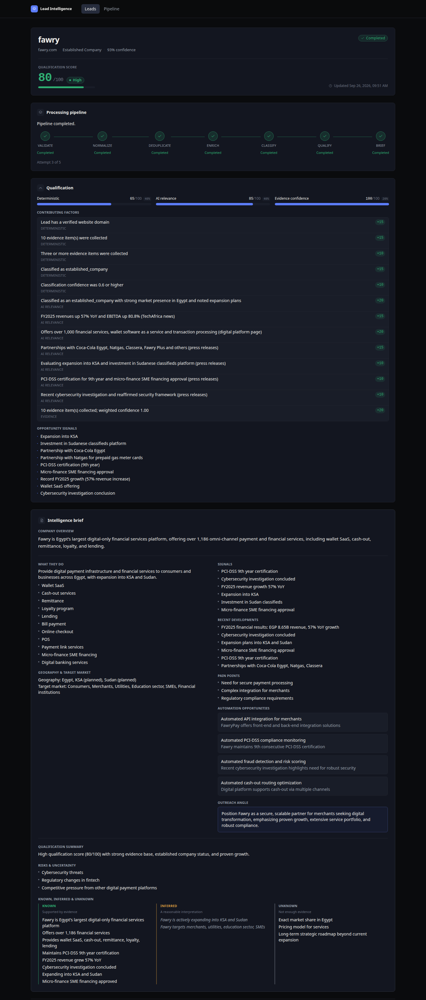
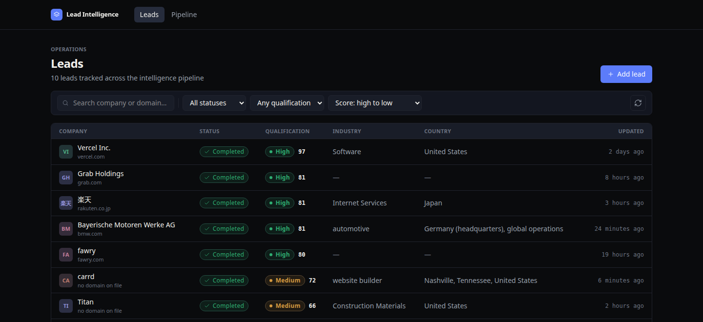
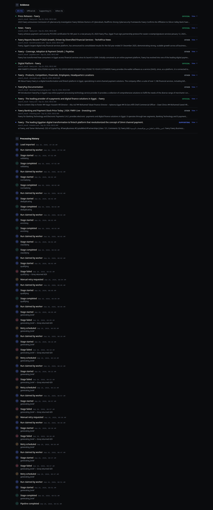
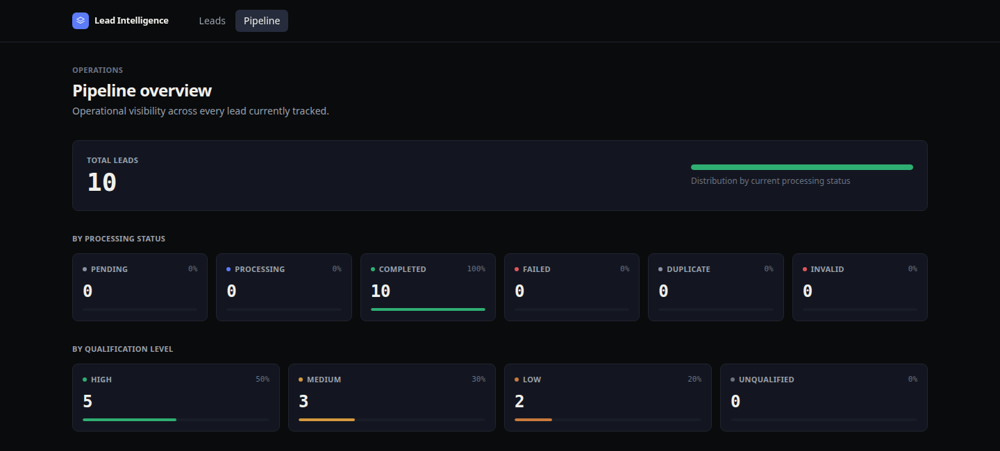
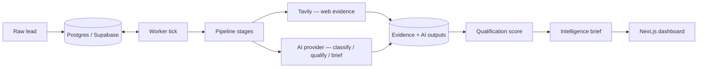

# AI Lead Intelligence & Outreach Pipeline

A durable, AI-powered pipeline that turns raw business leads — a company name, a website, maybe a contact — into enriched, qualified, evidence-backed intelligence: a classification, a qualification score with a transparent breakdown, and a structured intelligence brief, all grounded in real web evidence that's retained alongside the conclusions.

**[Open the live application →](https://automation-data-system.vercel.app/)**

A deployed production instance demonstrating lead ingestion, web enrichment, AI classification, qualification, evidence-backed intelligence briefs, and full processing-history visibility. Add a lead, watch it move through the pipeline stage by stage, and inspect exactly what evidence and reasoning produced its score.



## Overview

A sales or business lead usually starts as almost nothing — a company name, maybe a website, maybe a contact. This system turns that into:

- a normalized, deduplicated company identity
- real web evidence, collected and categorized by relevance
- an AI-driven company classification
- a qualification score combining deterministic signals, AI assessment, and evidence confidence
- a structured intelligence brief: what the company does, signals, recent developments, pain points, automation opportunities, an outreach angle, and explicit risks/uncertainty
- a clear separation between what's **known** (evidence-backed), **inferred** (a reasonable interpretation), and **unknown**
- a full, inspectable trail of every stage, retry, and failure that produced the result

## Why I Built It

The easy version of this product is one AI call: paste a company name in, get a paragraph out. That's fast to build and fragile in practice — a rate limit, a timeout, or a malformed response loses the entire operation, with nothing to resume from and no record of what happened.

This system instead treats lead processing as a durable, multi-stage pipeline with persistent state: every lead has a row tracking exactly which stage it's on, how many times it's been attempted, and why any attempt failed. A transient failure — a rate limit, a timeout, a temporarily overloaded provider — gets retried with backoff from exactly where it stopped, not from scratch, and every stage transition, retry, and failure is recorded in an audit log. Nothing has to be re-run from the beginning because one external API had a bad moment.

## Screenshots

### Leads Operations Dashboard
Search, filter, and sort across every tracked lead — qualification score, status, industry, and country at a glance.



### Evidence & Processing History
Every conclusion traces back to real, categorized web evidence, and every stage transition — including real retries and recoveries — is kept in an inspectable audit trail.



### Pipeline Overview
Operational visibility across every lead currently tracked, by processing status and qualification level.



## Architecture



The worker is invoked on a schedule (Vercel Cron, once daily on the current Hobby-tier deployment) and also on demand — either an unauthenticated on-demand endpoint the dashboard's "Process now"/"Retry" actions call, or an external cron-ping service, so a lead doesn't have to wait for the next scheduled run. Each invocation claims a small batch of due work atomically from Postgres and advances each claimed lead by one stage.

**Stack actually in use:**

- **Frontend:** Next.js 16 (App Router), TypeScript, React 19, Tailwind CSS v4
- **Database:** Supabase (PostgreSQL) — also the durable job queue; no separate queue service
- **AI providers:** pluggable — Gemini, Groq, or earthruntime (all OpenAI/Gemini-compatible chat completion APIs), selected via one environment variable
- **Web research:** Tavily
- **Validation:** Zod
- **Testing:** Vitest
- **Hosting:** Vercel, with Vercel Cron for the scheduled tick

## Pipeline

Each lead moves through seven explicit stages, tracked on its own row:

### 1. Validation
Confirms the incoming lead has the minimum required shape (e.g. a non-blank company name) before anything else runs.

### 2. Normalization
Canonicalizes the website into a registrable domain and normalizes any email address.

### 3. Deduplication
Uses the normalized registrable domain to detect an exact duplicate of an existing lead, with a Postgres unique constraint as the final safeguard against a race.

### 4. Enrichment
Collects targeted web evidence for the company via Tavily.

### 5. Classification
An AI call classifies the company (type, industry, business model, geography, target market) using only the collected evidence — never a guess beyond it.

### 6. Qualification
Combines three components into one score:

- **40% deterministic** — objective signals such as having a verified domain, contact info, and how much evidence was collected
- **40% AI** — the AI provider's assessed fit against the evidence
- **20% evidence confidence** — how much, and how corroborating, the collected evidence is

The final score buckets into **high** (≥80), **medium** (≥60), **low** (≥30), or **unqualified**.

### 7. Intelligence Brief
Produces a structured brief from everything collected so far: what the company does, signals, recent developments, pain points, automation opportunities, an outreach angle, a qualification summary, risks and uncertainty, and an explicit known/inferred/unknown breakdown.

## Reliability & Failure Recovery

This is the part of the system that isn't visible in a single AI call, and is arguably the point of the whole exercise:

- **Postgres-backed queue** — no separate queue service; `lead_processing_runs` rows are the durable job state
- **Atomic job claiming** — `SELECT ... FOR UPDATE SKIP LOCKED` inside a single `UPDATE ... FROM` statement, so claiming a batch of due work is one atomic operation, never a separate select-then-update that could race
- **Worker leases** — a claimed run holds a lease (`locked_by`, `lease_expires_at`); a worker that crashes mid-execution doesn't hold the row forever
- **Stale-lease recovery** — a run whose lease has expired is claimable again, distinguished in the audit log as a recovery rather than a fresh claim
- **Retry with exponential backoff and jitter** — a failed, retryable stage schedules its own next attempt (1 minute base, capped at 30 minutes, ±20% jitter so a burst of failures doesn't retry in lockstep)
- **Bounded attempts** — a default of 5 attempts per stage before a run is marked permanently failed rather than retried forever; a stage that has never been attempted always gets its own full budget, not one inherited from earlier, already-successful stages
- **Explicit state machine** — every status transition is checked against an allowed-transitions table; an impossible jump throws rather than silently persisting
- **Idempotent output persistence** — each AI-output table has a `unique(run_id)` constraint, checked before every write, so a retried stage after a partial completion never double-writes
- **Full audit trail** — every claim, stage start/completion/failure, retry, and recovery is recorded as a processing event, visible in the dashboard

Transient provider failures — a rate limit, a timeout, a temporarily overloaded model — get retried without losing any pipeline state. This is not a claim of zero downtime or guaranteed delivery; it's a system designed so a transient failure costs a retry, not the whole operation.

## Structured AI Outputs

AI responses are never persisted as-is. Each stage's expected output is a Zod schema (classification, qualification, intelligence brief); a response that fails validation triggers one repair re-prompt carrying the validation error back to the model, and only a validated result is written to the database. When there's no evidence to reason over, the affected stage returns an explicit, deterministic "not enough information" result instead of spending an AI call on an ungrounded guess.

## Evidence-Backed Intelligence

The system doesn't ask an AI provider "tell me about this company" and print the answer. Every AI-generated conclusion is built from evidence that's collected, categorized, and retained first:

1. collect web evidence for the company (Tavily)
2. categorize each item's relevance (official / supporting / other)
3. feed only that evidence into classification, qualification, and brief generation
4. generate structured, schema-validated output from it
5. retain the underlying evidence alongside the conclusions — visible in the dashboard, not discarded after use

## Dashboard

- **Leads table** — search, filter by status/qualification, sort, and paginate across every tracked lead
- **Lead detail** — company header, live pipeline stepper, qualification score and its full breakdown, the intelligence brief, known/inferred/unknown facts, categorized evidence, and complete processing history
- **Retry / Process now** — a stopped-but-retryable run can be manually retried; either action advances the pipeline until it completes or hits something that genuinely needs attention, rather than one click per stage
- **Pipeline overview** — aggregate counts by processing status and qualification level across every lead

## Tech Stack

| Layer | Technology |
|---|---|
| Frontend | Next.js 16, TypeScript, React 19, Tailwind CSS v4 |
| Database / queue | Supabase (PostgreSQL) |
| AI providers | Gemini, Groq, or earthruntime (pluggable, OpenAI/Gemini-compatible) |
| Web research | Tavily |
| Validation | Zod |
| Testing | Vitest |
| Hosting | Vercel (+ Vercel Cron) |

## API / System Components

| Route | Purpose |
|---|---|
| `POST /api/leads` | Ingest a new lead |
| `GET /api/leads` | List leads (search/filter/sort/paginate) |
| `GET /api/leads/:id` | Full lead detail — lead, run, evidence, classification, qualification, brief |
| `GET /api/leads/:id/events` | Processing history for a lead |
| `POST /api/leads/:id/retry` | Reset a stopped, retryable run |
| `GET /api/leads/stats` | Aggregate counts by status and qualification level |
| `GET`/`POST /api/worker/tick` | Privileged worker tick — requires `Authorization: Bearer <CRON_SECRET>`; what Vercel Cron itself calls |
| `GET`/`POST /api/worker/process` | Unauthenticated worker tick — same underlying work, for the dashboard's own "Process now"/"Retry" actions and external cron-ping schedules |

## Local Development

```bash
# 1. Clone
git clone https://github.com/melancholy1212/Automation-Data-System.git
cd Automation-Data-System

# 2. Install dependencies
npm install

# 3. Configure environment
cp .env.example .env.local
# fill in SUPABASE_URL / SUPABASE_SERVICE_ROLE_KEY and at least one AI
# provider's key (see Environment Variables below)

# 4. Supabase — either link an existing project and push migrations...
npx supabase link --project-ref <your-project-ref>
npx supabase db push
# ...or run a local stack and apply migrations against it
npx supabase start
npx supabase db reset

# 5. Run the development server
npm run dev

# 6. Run tests
npm test

# 7. Type-check
npm run typecheck

# 8. Lint
npm run lint

# 9. Production build
npm run build
```

## Environment Variables

All variable names below are documented in `.env.example`; none of the actual values shown there are real.

| Variable | Purpose |
|---|---|
| `SUPABASE_URL` | Supabase project URL |
| `SUPABASE_SERVICE_ROLE_KEY` | Server-only key that bypasses row-level security — never exposed to the browser |
| `TEST_DATABASE_URL` | Optional — a throwaway Postgres instance for the DB-integration test suite; those tests skip automatically when unset |
| `CRON_SECRET` | Authenticates `/api/worker/tick`; Vercel Cron sends this automatically when the variable is set on the project |
| `WORKER_BATCH_SIZE`, `WORKER_CONCURRENCY`, `WORKER_LEASE_SECONDS`, `WORKER_EXECUTION_BUDGET_MS` | Optional worker tuning (all have defaults; see `.env.example`) |
| `TAVILY_API_KEY` | Web evidence provider |
| `AI_PROVIDER` | `gemini` \| `groq` \| `earthruntime` — which AI provider is active (defaults to `groq`) |
| `GEMINI_API_KEY`, `GEMINI_MODEL` | Gemini provider config |
| `GROQ_API_KEY`, `GROQ_MODEL` | Groq provider config |
| `EARTHRUNTIME_API_KEY`, `EARTHRUNTIME_MODEL` | earthruntime provider config |

## Testing

```bash
npm test
```

229 passing tests across the pipeline stages, worker/retry logic, AI-output schemas, both AI providers, API routes, and UI-facing status logic. An additional 23 tests exercise real Postgres constraints and worker concurrency directly (`src/test/db`) and are skipped automatically unless `TEST_DATABASE_URL` points at a real database.

## Production

**Live demo:** [https://automation-data-system.vercel.app/](https://automation-data-system.vercel.app/)

## Project Status

**Completed.** All seven pipeline stages, the durable worker, the dashboard, and structured AI outputs are built, tested, and deployed to production.

## Engineering Highlights

- Durable, multi-stage lead processing — not a single AI call
- Postgres-backed job queue with atomic worker claiming (`SELECT ... FOR UPDATE SKIP LOCKED`)
- Lease-based crash recovery with stale-lease detection
- Retry with exponential backoff and jitter, bounded attempts, per-stage budget isolation
- Explicit, validated state machine for every status transition
- Structured, schema-validated AI outputs with automatic repair on a validation miss
- Evidence-backed intelligence — every conclusion traces back to retained, categorized web evidence
- Persistent, complete processing history for every lead
- Transparent qualification breakdown (deterministic / AI / evidence confidence)
- Deployed, working production instance
